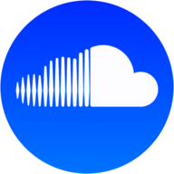
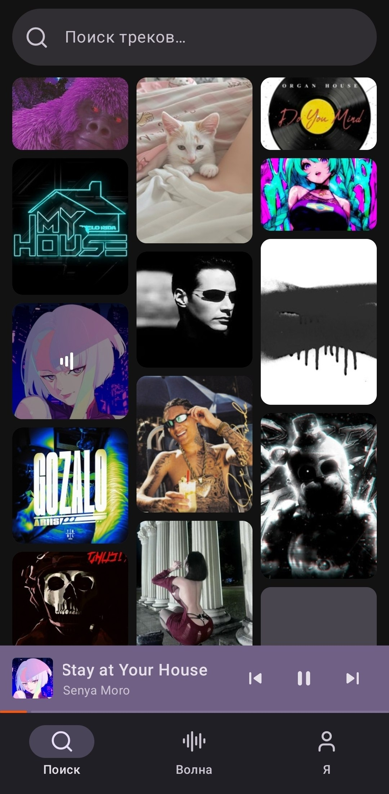
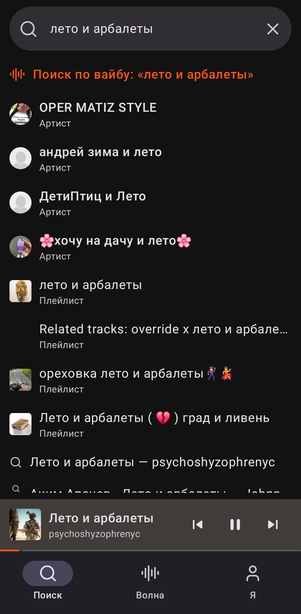
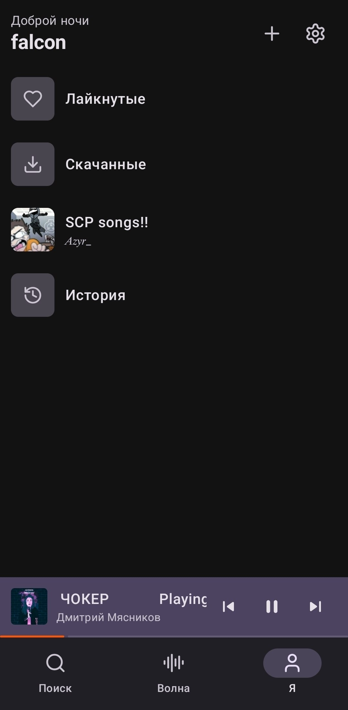
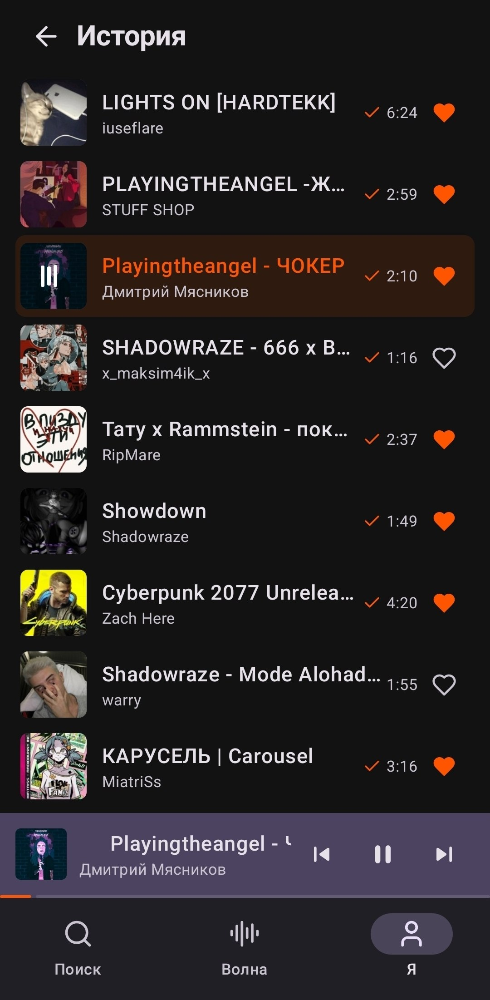
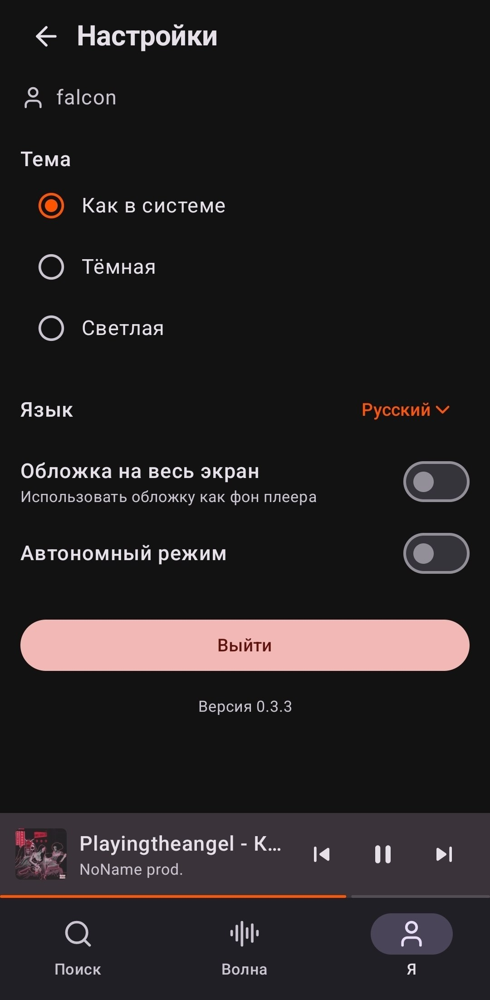

<p align="center">
<a href="https://github.com/okeydw/SoundCloud-Android/releases/latest">

</a>
</p>

<h1 align="center">SoundCloud Android</h1>

<p align="center">
<b>Неофициальный клиент SoundCloud для Android</b><br>
Без рекламы · Без капчи · Без цензуры · Доступно в России
</p>

<p align="center">
<a href="https://github.com/okeydw/SoundCloud-Android/releases/latest">

</a>

<a href="LICENSE">

</a>
</p>

<p align="center">
<a href="https://github.com/okeydw/SoundCloud-Android/releases/latest">

</a>
</p>

---

> [!WARNING]
> ⚠️ **Из-за систем безопасности основного API при входе вас может выкинуть из другой сессии.** Если вы залогинены на другом устройстве (например в десктоп-клиенте), вход здесь может «отвязать» ту сессию, и наоборот. Это ограничение бэкенда, а не бага приложения - просто войдите заново там, где нужно.

---

## Что это?

**SoundCloud Android** - нативный клиент SoundCloud для телефона. Использует тот же бэкенд, что и [SoundCloud-Desktop](https://github.com/zxcloli666/SoundCloud-Desktop), поэтому весь каталог доступен напрямую.

Написан на **Kotlin + Jetpack Compose + Media3**, работает нативно и потребляет минимум ресурсов.

На данный момент сделана лёгковесная версия без излишеств, дизайн прикручу, когда пойму что багов нет и функционал в полном объёме, после разделю на две версии: 

> `Full` - много красивых блестяшек и дизайн схожий с декстопной версией.

> `Lite` - упрощённый дизайн, кто ценит минимализм и слабые телефоны. 

### Для IOS порта не будет!


---

## Возможности

- **Поиск и Волна** - поиск треков/артистов/плейлистов и персональная лента рекомендаций
- **Плеер** - фоновое воспроизведение, управление из уведомления, waveform, shuffle/repeat, жесты
- **Библиотека** - лайки/дизлайки, плейлисты, история, профили артистов
- **Оффлайн** - скачивание треков и автономный режим с кэшем
- **Оформление** - тёмная/светлая тема, иммерсивный режим и 9 языков

---

## Скачать

Перейди на [страницу релизов](https://github.com/okeydw/SoundCloud-Android/releases/latest) и скачай `.apk`.

**Установка:** открой скачанный файл на телефоне и разреши установку из неизвестных источников.

**Требования:** Android 8.0 (Oreo) или новее.

---

## Скриншоты

<p align="center">



</p>
<p align="center">




</p>

---

## Обратная связь

Нашёл баг или есть идея? - [открой issue](https://github.com/okeydw/SoundCloud-Android/issues/new/choose).


---


## Стек

| Слой | Технологии |
| --- | --- |
| Язык | Kotlin |
| UI | Jetpack Compose, Material 3 |
| Аудио | Media3 (ExoPlayer + MediaSession), фоновый сервис с уведомлением |
| Сеть | OkHttp (+ дисковый кэш), kotlinx.serialization |
| Изображения | Coil (+ Palette для подкраски под обложку) |
| Хранение | SharedPreferences (настройки, сессия), JSON-индекс скачанных треков |

Тот же бэкенд, что и у [SoundCloud-Desktop](https://github.com/zxcloli666/SoundCloud-Desktop) - приложение работает как ещё один клиент к нему.

**Совместимость:** `minSdk 26` (Android 8.0) … (Android `targetSdk 35`, `compileSdk 35` .

---

## Структура

```
app/src/main/java/com/scd/android/
  App.kt              - Application: инициализация сессии, кэша, настроек, Coil-загрузчик обложек через прокси (уникальный ключ на картинку)
  MainActivity.kt     - точка входа, навигация (Поиск / Волна / Я), плитки-мозаика, баннер «нет интернета», отсев недоступных треков, deep-link из уведомлений
  Api.kt              - API-клиент: поиск, стрим, обложки, лайки/дизлайки треков и плейлистов, история, модели данных; многоуровневый HTTP-кэш (холодные данные - надолго)
  NetMonitor.kt       - проверка сети (Wi-Fi / моб. данные) + офлайн-фолбэк из кэша
  Prefs.kt            - настройки (тема, язык, офлайн, иммерсив) + кэш имени пользователя
  LocaleHelper.kt     - подмена локали приложения (смена языка)

  PlaybackService.kt  - MediaSessionService: фоновый плеер, уведомление, лайк/дизлайк в нём, открытие плеера по тапу
  Player.kt           - мини-плеер и полноэкранный плеер (waveform, жесты, shuffle/repeat, иммерсив, marquee, добавление в плейлист)
  NowPlaying.kt       - глобальное состояние плеера + события навигации/обновления плейлистов (PlaylistEvents, NavEvents)

  WaveScreen.kt       - Волна: лента с пейджером, свайпы и двойной тап = лайк с анимацией, обновление
  ArtistScreen.kt     - профиль автора: треки и плейлисты (в т.ч. офлайн из скачанного)
  PlaylistScreen.kt   - экран плейлиста: список треков, лайк плейлиста, скачать всё / отменить
  LibraryScreen.kt    - вкладка «Я»: приветствие, лайкнутые, скачанные, свои и лайкнутые плейлисты, история + экран настроек

  Likes.kt / Dislikes.kt - состояние лайков/дизлайков треков (взаимоисключающие, синк с бэкендом)
  LikedPlaylists.kt   - состояние лайкнутых плейлистов (синк с бэкендом)
  Downloads.kt        - скачивание треков в приватную папку, индекс, уведомление с прогрессом, отмена и deep-link
  Genres.kt           - список жанров для плиток на пустом поиске

app/src/main/res/
  drawable/           - векторные иконки (стиль Lucide) + логотип
  values/, values-*/  - строки на 9 языках + values-night (тёмная тема)

proguard-rules.pro    - правила R8 для release-сборки (serialization / OkHttp)
.github/workflows/    - CI: lint, тесты, сборка debug APK
```

Полный список изменений - в [CHANGELOG.md](CHANGELOG.md).

---

## Лицензия

MIT. Подробности - в файле [LICENSE](LICENSE).

_SoundCloud - торговая марка SoundCloud Ltd. Это приложение не аффилировано с SoundCloud._

