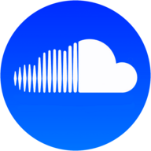
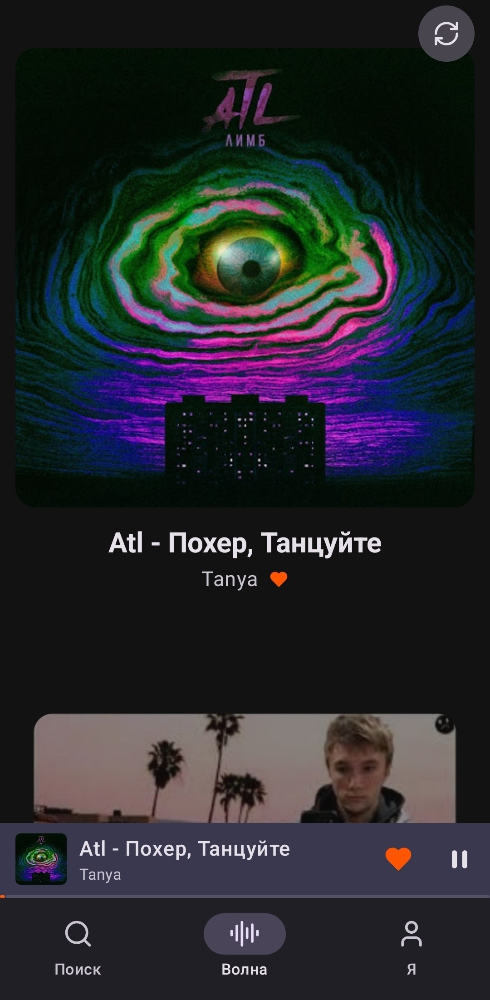
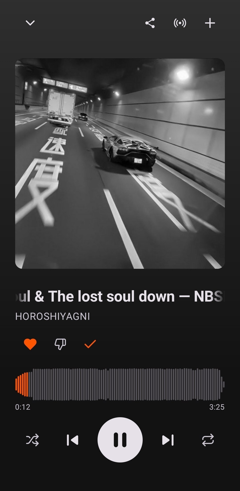
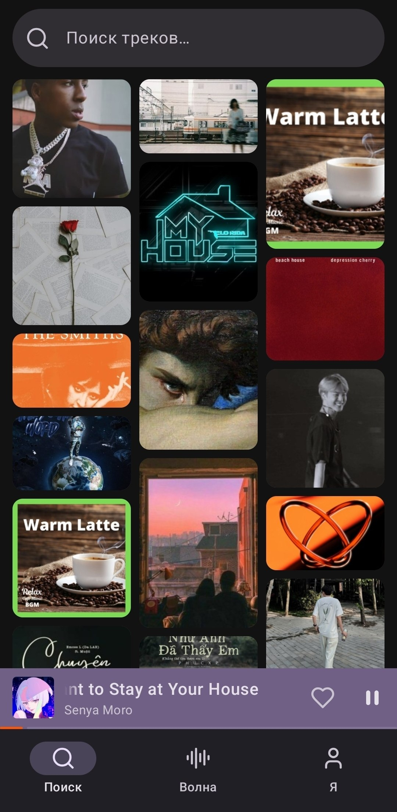
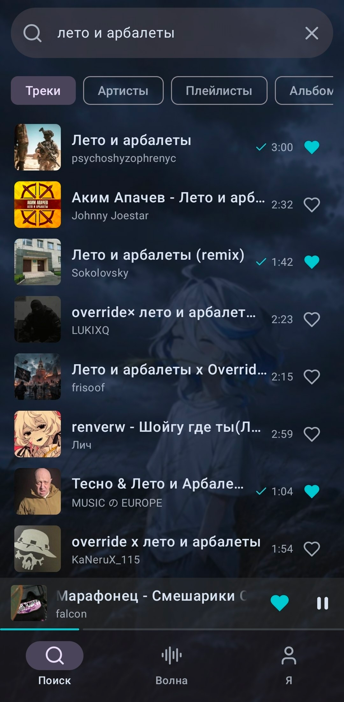
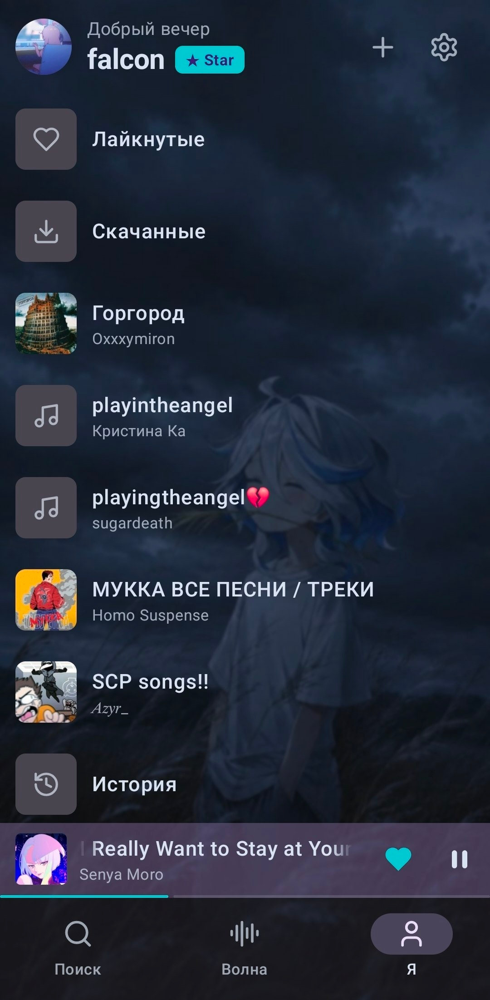
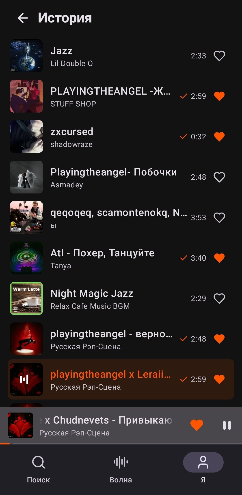
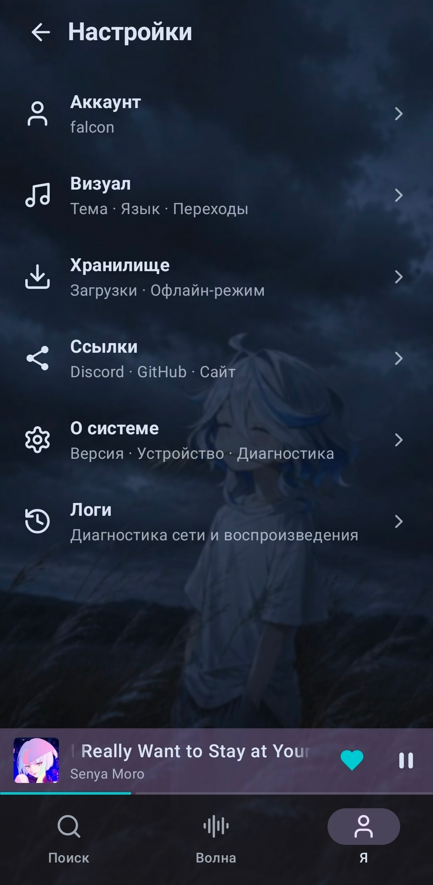

<h1 align="center">SoundCloud Android</h1>

<b>[<a href="https://github.com/zxcloli666/SoundCloud-Desktop">데스크톱 버전</a>]</b> 
<b>비공식 SoundCloud Android 클라이언트</b> 
광고 없음 · 캡차 없음 · 검열 없음

---

## 이게 뭔가요?

**SoundCloud Android**는 휴대폰용 네이티브 SoundCloud 클라이언트입니다. [SoundCloud-Desktop](https://github.com/zxcloli666/SoundCloud-Desktop)과 동일한 백엔드를 사용하므로 전체 카탈로그에 바로 접근할 수 있습니다.

**Kotlin + Jetpack Compose + Media3**로 작성되어 네이티브로 동작하며 리소스를 최소한으로 사용합니다.

현재는 군더더기 없는 경량 버전입니다. 버그가 없고 기능이 완성되었다고 확신되면 디자인을 다듬은 뒤 두 가지 버전으로 나눌 예정입니다:

> `Full` — 화려한 효과가 많고 데스크톱 버전에 가까운 디자인.

> `Lite` — 미니멀함과 저사양 기기를 중시하는 사용자를 위한 단순한 디자인.

### iOS 포팅은 없습니다!

---

## 기능

- **검색 & Wave** — 트랙/아티스트/재생목록 검색과 개인 추천 피드
- **플레이어** — 백그라운드 재생, 알림에서 제어, 파형, 셔플/반복, 제스처
- **라이브러리** — 좋아요/싫어요, 재생목록, 기록, 아티스트 프로필
- **오프라인** — 트랙 다운로드와 캐시 기반 오프라인 모드
- **외관** — 다크/라이트 테마, 몰입 모드, 9개 언어

---

## 다운로드

[릴리스 페이지](https://github.com/okeydw/SoundCloud-Android/releases/latest)에서 `.apk`를 받으세요.

**설치:** 다운로드한 파일을 휴대폰에서 열고 알 수 없는 출처 설치를 허용하세요.

**요구 사항:** Android 8.0 (Oreo) 이상.

---

## 스크린샷

> 배경, 글자 색, 테마를 직접 바꿀 수 있습니다 — 나만의 배경 이미지, RGB 팔레트, 준비된 테마.

---

## 피드백

버그를 찾았거나 아이디어가 있나요? — [이슈 열기](https://github.com/okeydw/SoundCloud-Android/issues/new/choose).

---

## 스택

| 계층 | 기술 |
| --- | --- |
| 언어 | Kotlin |
| UI | Jetpack Compose, Material 3 |
| 오디오 | Media3 (ExoPlayer + MediaSession), 알림이 있는 포그라운드 서비스 |
| 네트워크 | OkHttp (+ 디스크 캐시), kotlinx.serialization |
| 이미지 | Coil (+ 커버에 맞춘 색조용 Palette) |
| 저장 | SharedPreferences (설정, 세션), 다운로드한 트랙의 JSON 인덱스 |

[SoundCloud-Desktop](https://github.com/zxcloli666/SoundCloud-Desktop)과 동일한 백엔드 — 앱은 그것의 또 다른 클라이언트로 동작합니다.

**호환성:** `minSdk 26` (Android 8.0) … `targetSdk 35`, `compileSdk 35`.

---

전체 변경 로그는 [CHANGELOG.md](../CHANGELOG.md)에 있습니다.

---

## 라이선스

MIT. 자세한 내용은 [LICENSE](../LICENSE) 파일 참고.

_SoundCloud는 SoundCloud Ltd.의 상표입니다. 이 앱은 SoundCloud와 제휴하지 않았습니다._
